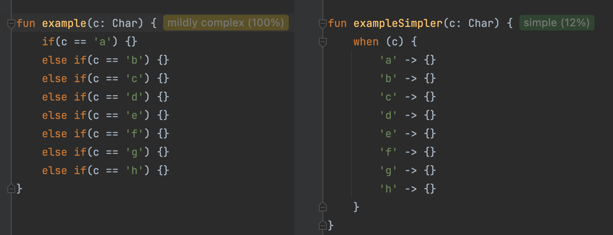

# Code Complexity plugin for IDEA

<!-- Plugin description -->
This plugin calculates code complexity metric right in the editor and shows the complexity in the hint next to the method/class. It's based on the **Cognitive Complexity** metric proposed by G. Ann Campbell in [Cognitive Complexity - A new way of measuring understandability](https://www.sonarsource.com/docs/CognitiveComplexity.pdf).

Works with Java and Kotlin. Python support is the next to implement.
<!-- Plugin description end -->

---

---
## Installation

- Using IDE built-in plugin system:

  <kbd>Settings/Preferences</kbd> > <kbd>Plugins</kbd> > <kbd>Marketplace</kbd> > <kbd>Search for "code-complexity-plugin"</kbd> >
  <kbd>Install Plugin</kbd>

- Manually:

  Download the [latest release](https://github.com/nikolaikopernik/code-complexity-plugin/releases/latest) and install it manually using
  <kbd>Settings/Preferences</kbd> > <kbd>Plugins</kbd> > <kbd>⚙️</kbd> > <kbd>Install plugin from disk...</kbd>

---
Plugin based on the [IntelliJ Platform Plugin Template][template].

[template]: https://github.com/JetBrains/intellij-platform-plugin-template
[docs:plugin-description]: https://plugins.jetbrains.com/docs/intellij/plugin-user-experience.html#plugin-description-and-presentation
